# AI-Assisted Psychological Research

From Experiment Design to Manuscript Composition

Zhuanghua Shi · MSense Lab · LMU Munich

<div class="abs-br m-6 flex gap-2">
  <a href="https://github.com/msenselab" target="_blank" alt="Claude Code"
    class="text-xl slidev-icon-btn opacity-50 !border-none !hover:text-white">
    
  </a>
</div>

---
layout: split64
image: /figures/ai-speed.png
---
::left::
# The AI Revolution is Here

<div class="text-2xl mt-8">

🚀 **The Pace of Change**

- AI capabilities increase exponentially
- 2023: ChatGPT changes the game
- 2024: Multi-modal models, coding agents, research assistants
- 2025: **AI agents that can complete entire research workflows**

</div>

<div v-click class="mt-8 p-4 bg-blue-100 dark:bg-blue-900 rounded-lg">
  <div class="text-xl font-bold mb-2">⚠️ Critical Principle</div>
  <div class="text-lg">
    Embrace AI, but <span class="text-red-600 font-bold">HUMAN MUST STAY IN THE LOOP</span>!
  </div>
</div>

<style>
.slidev-vclick-target {
  transition: all 500ms ease;
}
</style>

---
layout: default
---

# Why Human-in-the-Loop Matters

<div class="grid grid-cols-2 gap-8 mt-8">

<div>

## ✅ AI Excels At

<v-click>

- **Speed**: Process data in seconds
- **Consistency**: No fatigue or bias
- **Scale**: Handle massive datasets
- **Repetition**: Automate tedious tasks
- **Pattern recognition**: Find hidden insights

</v-click>

</div>

<div>

## ⚠️ AI Needs Human For

<v-click>

- **Critical thinking**: Evaluate validity
- **Domain expertise**: Interpret results
- **Ethical judgment**: Research integrity
- **Creativity**: Novel hypotheses
- **Quality control**: Verify every output

</v-click>

</div>

</div>

<div v-click class="mt-8 text-center text-xl font-bold text-blue-600">
  AI as your research assistant, not replacement
</div>

---
layout: two-cols-header
---

# Required Software Stack

::left::

<div class="mt-8">

## Code Editors with AI Integration


1. **VS Code** or **Positron** - Free, most popular
   - Download: [code.visualstudio.com](https://code.visualstudio.com)
   - Download: [positron.posit.co](https://positron.posit.co/)
   
2. Extensions: GitHub Copilot, Claude Code, Cursor integration

</div>

::right::


---
layout: default
---

# AI Coding Assistants

<div class="grid grid-cols-2 gap-6 mt-6">

<div v-click>

### **Claude Code** (Anthropic)
- CLI tool for terminal
- Best for research workflows
- Strong reasoning capabilities
- Install: `npm install -g @anthropic-ai/claude-code`

</div>

<div v-click>

### **GitHub Copilot** (Microsoft/OpenAI)
- Inline code suggestions / agents
- **FREE for university staff/students!** 🎓
- Apply: [education.github.com](https://education.github.com)
- Best for: Autocomplete, boilerplate

</div>

<div v-click>

### **Gemini CLI** (Google)
- Google's AI in terminal
- Strong multimodal capabilities
- Install: `npm install -g @google/gemini-cli`

</div>

<div v-click>

### **OpenAI Codex**
- Via API or ChatGPT Plus
- Code Interpreter for analysis
- Install: `npm install -g @openai/codex`

</div>

</div>

<div v-click class="mt-6 p-4 bg-green-100 dark:bg-green-900 rounded-lg text-center">
  <strong>💡 Pro Tip:</strong> GitHub Copilot is FREE for university members - apply with your LMU email!
</div>

---
layout: default
---

# Today's Demonstration

## A Full Research Workflow with a recent published Study

<div class="mt-6">

<v-click>

**Study**: [Bocheva & Rahnev (2025)](https://pubmed.ncbi.nlm.nih.gov/40775585/) 
- No particularly reason to select this, simply came across this paper recently 
- This demonstration is to show proof of concept of AI-assisted research workflow
- The Study: 
  - 1000 trials per participant
  - Hand alternates unpredictably trial-by-trial
  - Measure: How confidence on trial *t* depends on trial *t*−1

**Our Goal**: Complete entire research workflow using AI agents

</v-click>

</div>

<div v-click class="mt-8 p-4 bg-yellow-100 dark:bg-yellow-900 rounded-lg">
  <strong>Key Point:</strong> We'll pretend we're developing this study from scratch, but use real data for speed
</div>

---
layout: default
---

# The 5-Stage Workflow

```mermaid {scale: 0.8}
graph LR
    A[📋 Stage 1<br/>Experiment<br/>Design] --> B[📊 Stage 2<br/>Data<br/>Collection]
    B --> C[📈 Stage 3<br/>Data<br/>Analysis]
    C --> D[🔍 Stage 4<br/>Critical<br/>Review]
    D --> E[📝 Stage 5<br/>Manuscript<br/>Writing]

    style A fill:#e3f2fd
    style B fill:#f3e5f5
    style C fill:#e8f5e9
    style D fill:#fff3e0
    style E fill:#fce4ec
```

<div class="mt-6">



</div>

<div v-click class="mt-8 text-center text-xl">
  Let's look into each stage! 🚀
</div>

---
layout: split64
image: /figures/psychopy_task.png
caption: "PsychoPy Builder Interface"
---

::left::

# Stage 1: Experiment Design


### Task: Build PsychoPy Experiment

<v-click>

**Input**:
- Experiment specifications (Markdown)
- Skeleton template (.psyexp XML file)

**AI Agent Task**:
- Modify XML structure (not Python!)
- Configure Gabor stimulus (4°, 1.5 cpd, ±45°)
- Set timing (500ms fixation, 200ms stimulus)
- Implement hand-specific key mappings
- Create trial structure (1000 trials, blocks)

**Output**: Runnable .psyexp file + conditions.csv

</v-click>

::right::

<!-- Image will be shown here from layout -->

---
layout: default
---

# Stage 1: Hands-On Demo

<div class="mt-8">

```bash
# Navigate to experiment folder
cd psychopy/

# Open specifications
cat readme.md

# Let AI agent modify the skeleton
"based on @psychopy/readme.md to build Stage 1 Experiment, save as study.psyexp"
```

</div>

<div v-click class="mt-8 p-4 bg-blue-100 dark:bg-blue-900 rounded-lg">
  <strong>🎯 Watch for:</strong>
  <ul class="mt-2">
    <li>✅ Read the skeleton.psyexp file to understand the current structure</li>
    <li>✅ Create simple exp_cond.csv file (2 orientations × 2 contrasts × 2 hands = 8 conditions)</li>
    <li>✅ Add instruction routine at the beginning of the experiment</li>
    <li>✅ ...</li>
  </ul>
</div>

---
layout: two-cols-header
---
# From Sketch to Experiment (fully automated)
::left::

<div class="mt-8">

</div>

::right::

<div class="mt-8">

</div>

---
layout: default
---

# Stage 2: Data Collection 

<div class="mt-6">

- Data from Published Study

<v-clicks>

**Typical Workflow**: Run experiment → collect data → wait for participants

**Today**: We use existing data from published study (pretend it's fresh!)

**Data Format** (CSV with 9 columns):

</v-clicks>

</div>

<div v-click class="mt-4">

```csv
Subject,Stimulus,Response,Confidence,Correct,Contrast,Side,RT_Decision,RT_Confidence
1,1,2,1,0,2,1,1.04410273199028,0.265720397001132
1,2,1,1,0,1,2,1.54540622899367,0.225159565001377
1,1,1,2,1,1,1,1.63487691100454,0.471257911005523
...
```

</div>

---
layout: default
---

# Stage 3: Data Analysis


<div class="mt-0 grid grid-cols-2 gap-2">

<div>

<v-click>

1. **Data cleaning**
   - Exclude low-quality participants
   - Remove outlier trials (RT > 3s)

2. **Serial dependence regression**
   - Confidence(t) ~ Confidence(t-1)
   - Choice(t) ~ Choice(t-1)
   - Separate: Repeat-hand vs. Switch-hand

3. **Statistical tests**
   - One-sample t-tests (slopes vs. 0)
   - Paired t-tests (repeat vs. switch)
   - Effect sizes (Cohen's d)

</v-click>

</div>

<div>

### **Outputs**

<v-click>

- Publication-quality figures
  - Boxplots with individual data
  - Error bars (SEM)
  - Colorblind-friendly palette

- Statistical reporting
  - APA format
  - Full regression tables

- Reproducible code
  - Python (pandas, scipy, seaborn)
  - R/Quarto alternative

</v-click>

</div>

</div>

---
layout: default
---

# Stage 3: Hands-On Demo

## Watch AI Analyze 42,000+ Trials

<div class="mt-6">

```python
# AI agent prompt
"""
Analyze serial dependence from study/Raw_Data/

1. Load exp1.csv and exp2.csv
2. Apply exclusion criteria:
   - Remove subjects using single confidence >90% trials
   - Remove trials with RT > 3s
3. For each subject, fit linear regression:
   - Confidence(t) = b0 + b1*Confidence(t-1) + error
   - Separately for repeat-hand and switch-hand trials
4. Extract slopes (b1) and run paired t-tests
5. Generate Figure 1: Boxplot with connecting lines
6. Report statistics in APA format
"""
```

</div>

<div v-click class="mt-6 p-4 bg-green-100 dark:bg-green-900 rounded-lg">
  <strong>⏱️ Time saved:</strong> Manual analysis ~2-3 days → AI completes in ~10 minutes
</div>


---
layout: split64
image: /figures/reviews.png
caption: "Review is a critical step"
---
::left::
# Stage 4: Critical Review 

## AI as Research Reviewer

<div class="mt-0">


**Problem**: First-pass analysis often has issues
- Statistical errors
- Suboptimal visualizations
- Missing checks
- Code quality issues

**Solution**: AI agent reviews its own work!


</div>

<div v-click class="mt-8">

```bash
# Generate professional review
claude-code "Review the analysis in analysis_v1.py.
Create REVIEW.md with:
- Statistical correctness check
- Visualization quality assessment
- Code quality evaluation
- Specific improvement suggestions (categorized by severity)"
```

</div>

---
layout: default
---

# Review → Improve → Iterate

<div class="mt-6">

## Example Review Output (REVIEW.md)

```markdown
## Critical Issues
- [ ] Exclusion criteria applied before/after lagging? (Check order)
- [ ] Convert python script to R/Quarto for publication readiness

## Important Improvements
- [ ] Figures: change bar plots to boxplots, combine experiments into panels
- [ ] add descriptive statistics table (accuracy, mean confidence, RT)
- [ ] Code: Modularize into functions for reusability

## Minor Suggestions
- [ ] Figure resolution: Increase to 300 DPI for publication
- [ ] Color palette: Use colorblind-friendly scheme
```

</div>

<div v-click class="mt-6 p-4 bg-orange-100 dark:bg-orange-900 rounded-lg">
  <strong>Human Role:</strong> Review REVIEW.md → Approve/reject suggestions → AI implements v2 <br/>
  Note: Here I <strong>purposely</strong> asked for conversion from python to R/Quarto to demonstrate flexibility
</div>

---
layout: default
---

# Stage 4: Hands-On Demo

## Iterative Improvement Workflow

<div class="mt-6">

### Step 1: AI generates REVIEW.md

```bash
claude-code "Review analysis_v1.py and figures_v1/,
create detailed REVIEW.md"
```

<v-click>

### Step 2: Human reviews and adds decisions

```markdown
## Critical Issues
- [x] APPROVED: Fix Cohen's d calculation ✓
- [ ] REJECTED: Exclusion order is correct, no change needed
```

</v-click>

<v-click>

### Step 3: AI implements approved changes

```bash
claude-code "Implement approved improvements from REVIEW.md,
save as analysis_v2.py and figures_v2/, create CHANGELOG.md"
```

</v-click>

</div>

---
layout: default
---

# Why This Matters: Version Control

<div class="mt-8 grid grid-cols-2 gap-8">

<div>

## Traditional Workflow
```
analysis.py (overwritten)
figures/ (replaced)

❌ Lost: Original version
❌ Lost: Decision rationale
❌ Hard to track: What changed?
```

</div>

<div>

## AI-Assisted Workflow
```
analysis_v1.py (preserved)
analysis_v2.py (improved)
REVIEW.md (decisions documented)
CHANGELOG.md (changes logged)
figures_v1/ (original)
figures_v2/ (improved)

✅ Full history
✅ Transparent decisions
✅ Reproducible evolution
```

</div>

</div>
<div v-click class="mt-6 p-4 bg-green-100 dark:bg-green-900 rounded-lg text-center">
  <strong>💡 Pro Tip:</strong> Use <strong>git</strong> to manage versions and track changes effectively. <br/>
  Computational reproducibility meets transparent research!
</div>

---
layout: default
---

# Stage 5: Manuscript Writing

## A Multi-Step Human-AI Collaboration

```mermaid {scale: 0.75}
graph LR
    A[📚 Literature<br/>Research <br/> Deep Research] --> B[💬 Interactive Review <br/> NotebookLM]
    B --> C[✍️ Introduction<br/>Structure]
    C --> D[📝 Write<br/>Introduction]
    D --> E[📊 Review<br/>Analysis Output]
    F[📝 Write Methods<br/>& Results]
    F --> G[💭 Outline<br/>Discussion]
    G --> H[📝 Write<br/>Discussion]
    H --> I[🎯 Abstract<br/>& Title]

    style A fill:#e3f2fd
    style B fill:#f3e5f5
    style C fill:#e8f5e9
    style D fill:#fff3e0
    style E fill:#fce4ec
    style F fill:#e3f2fd
    style G fill:#f3e5f5
    style H fill:#e8f5e9
    style I fill:#fff3e0
```

<div class="mt-4">



</div>

<div v-click class="mt-6 text-center text-xl">
  Each step involves <strong>human guidance</strong> + <strong>AI execution</strong>
</div>

---
layout: split64
image: /figures/literature_search.png
---

::left::

## Step 1: Deep Research

- Finding the Right Context

<div class="mt-0">

<v-click>

**Tools**: Gemini, Perplexity AI, Google NotebookLM

**Researcher Task**:
- Define research question, hypotheses
- Identify key search terms
- Evaluate relevance of results or reports

**AI Task**:
- Search academic databases (usually automated)
- Summarize recent findings and synthesize topics you asked. 

**Interaction**: 
- Through NotebookLM chat interface to refine understanding
- Generate ideas from multiple papers with chat interface
- Output: Structured notes (notes.md) for intro drafting

</v-click>

</div>

::right::

<!-- Image placeholder -->

---
layout: split64
image: /figures/notebooklm.png
---

::left::

## Step 2: Interactive Literature Review

- Google NotebookLM in Action

<div class="mt-0">

<v-click>

**Upload**: dozens papers (PDFs, <50 free!, Pro: 250 sources) to NotebookLM

**Interact via Chat**:
- "What are the main theories about serial dependence?"
- "Compare methods across studies"
- "What gaps exist in current research?"
- "Synthesize findings on confidence ratings"

**NotebookLM generates**:
- Comparative summaries
- Key quotes with citations
- Connections between papers
- Research gaps and opportunities

</v-click>

</div>

::right::

<!-- Image: NotebookLM interface screenshot -->

---
layout: default
---

# Step 2: Example NotebookLM Interaction

<div class="mt-6 grid grid-cols-2 gap-6">

<div>

### Your Questions to NotebookLM

```markdown
👤 "how do motor tasks influence sequential dependence?"

👤 "How does confidence relate to decision
   carryover effects?"

👤 "Compare the methods used to measure
   serial dependence across the uploaded papers"

```

</div>

<div v-click>

### NotebookLM Synthesizes

```markdown
🤖 Based on 15 papers:

"Here is a comprehensive breakdown of how motor tasks and related processes influence sequential dependence:
1. Role of Task Relevance and Post-Encoding Processes
...
• Encoding is Insufficient: Merely encoding the previous stimulus is often not sufficient to produce serial dependence

...

• Perceptual Choices vs. Motor Responses: The bias observed in serial dependence is often better described as an attraction toward previous perceptual choices or percepts rather than purely a bias toward previous motor responses or the physical stimulus [9]. 
"
```

</div>

</div>

<div v-click class="mt-6 p-4 bg-blue-100 dark:bg-blue-900 rounded-lg">
  <strong>💡 Key Point:</strong> NotebookLM helps you <strong>synthesize across papers</strong>, not just read them individually
</div>

---
layout: default
---

# Step 3: Introduction Structure

## From Notes to Outline

<div class="mt-6 grid grid-cols-2 gap-6">

<div>

### Human Task

<v-clicks>

1. **Review** NotebookLM synthesis
2. **Identify** key themes:
   - Serial dependence theory
   - Confidence in decisions
   - Motor-cognitive interactions
   - Research gap
3. **Draft outline**:
   - Paragraph 1: Intro to serial dependence
   - Paragraph 2: Confidence mechanisms
   - Paragraph 3: Motor influences on cognition
   - Paragraph 4: Current study aims

</v-clicks>

</div>

<div v-click>

### AI Agent Prompt (agents.md line 800-)

```bash
- **Input**: Literature reviews in `study/literature/`.
- **Task**: Write a 1500-word introduction with the following structure:
    1.  Start with a broad overview of confidence leak, using a vivid example.
    2.  Provide a brief review of confidence leak literature.
    3.  Identify the research gap: the missing link between motor responses and confidence leak.
    4.  Describe how this study addresses the gap (experimental design and hypothesis).
- **Style**: Avoid obvious AI-generated phrases (e.g., "delve", "shape", "dive in"). avoid using em-dashes. Transform passive constructions to active voice as default for energy and clarity. Eliminate heavy nominalization in favor of strong, precise verbs. Vary sentence length strategically to create natural rhythm and flow. Use cumulative sentence structures (subject + verb upfront, modifiers after) for clarity. avoid empty summary sentences like "Building on the literature, we advance ...", "By bridging classic theories ..., this study set this study sets the stage for a more comprehensive understanding...". 
```

**Output**: Draft introduction (1000-1200 words)

</div>

</div>

---

## Example Introduction Excerpt
<div class="mt-6 p-4 bg-green-100 dark:bg-green-900 rounded-lg">

Imagine a drone operator guiding a small craft through fog that keeps shifting in thickness. The operator decides that a faint glimmer ahead is a safe corridor and responds with full confidence. Moments later a new patch of turbulence appears, yet the operator still reports high certainty because the previous judgment felt so sure. This tendency to let earlier confidence seep into new decisions is the confidence leak phenomenon, and it persists even when each perceptual event is objectively independent. That leak can help when the world stays stable, but it can also misguide observers when conditions change rapidly, as every aviation instructor learns while training pilots to track instruments instead of gut feelings.

Researchers have now documented confidence leak across perceptual, cognitive, and memory paradigms (Rahnev et al., 2015; Kantner et al., 2019; Mei et al., 2023)....

</div>
<v-click>
<div class="mt-6 p-4 bg-yellow-100 dark:bg-yellow-900 rounded-lg">
  <strong>💡 Key Point:</strong> Strong researcher guidance ensures AI-generated text is coherent, relevant. Meticulously eliminate any AI hallucinations (particularly in citations and literature).
</div>
</v-click>
---
layout: default
---

## Step 4: Methods & Results Writing

### From Analysis Code to Narrative

<div class="mt-0">

#### Human Review Process

<v-clicks>

1. **Review** Quarto markdown output (analysis_v2.qmd)
   - Check figures for clarity
   - Verify statistical reporting
   - Identify key findings

2. **Annotate** the output file
   ```markdown
   # Key finding 1: Strong repeat-hand effect
   # EMPHASIZE: This is 3x larger than switch-hand!
   # Compare to Urai et al. (2019) who found no hand effect

   # Key finding 2: Confidence carryover
   # EMPHASIZE: Persists even with random stimuli
   # Novel contribution to literature
   ```

3. **Prompt AI** with annotated findings

</v-clicks>

</div>

---
layout: two-cols-header
---

# Step 4: Writing Methods & Results
::left::


```bash
# Methods Section
"Read:
- Experiment file (study.psyexp)
- Analysis script (analysis_v2.py)

Write Methods section covering:
- Participants (N, demographics, recruitment)
- Apparatus (display, stimulus properties)
- Procedure (trial structure, timing, responses)
- Exclusion criteria (from analysis script)

Style: Active voice, procedural narrative, APA format"
```
::right::

<v-click>

```bash
# Results Section
"Read:
- Analysis output (analysis_v2.qmd) with my annotations
- Figures (figures_v2/)

Write Results as flowing narrative:
- Lead with PHENOMENA, not statistics
- EMPHASIZE points I highlighted in annotations
- Integrate statistics naturally (not parenthetical dumps)
- Reference figures at key moments
- Use active verbs: 'strengthened', 'revealed', 'drove'
- Compare to previous literature where noted

Style: Story-driven, APA format statistics"
```

</v-click>

---
layout: default
---

## Step 4: Example - Stats-Driven vs. Story-Driven

<div class="mt-2 grid grid-cols-2 gap-6">

<div class="p-2 bg-red-100 dark:bg-red-900 rounded">

### ❌ Stats-Driven (Bad)

"We found a significant main effect of hand condition, *F*(1,41) = 67.8, *p* < .001.

Post-hoc tests revealed that repeat-hand trials (M = 0.35, SD = 0.18) differed from switch-hand trials (M = 0.12, SD = 0.15), *t*(41) = 8.23, *p* < .001, Cohen's *d* = 1.27.

There was also a significant effect of experiment, *F*(1,92) = 4.56, *p* = .035."

<div class="mt-4 text-sm">
❌ Statistics buried the story<br/>
❌ Passive voice ("was found")<br/>
❌ Hard to follow the narrative
</div>

</div>

<div class="p-4 bg-green-100 dark:bg-green-900 rounded">

### ✅ Story-Driven (Good)

"Repeating the same hand **nearly tripled** confidence carryover compared to switching hands (β = 0.35 vs. 0.12), *t*(41) = 8.23, *p* < .001, *d* = 1.27.

This dramatic strengthening **revealed a tight coupling** between motor actions and metacognitive judgments: confidence on trial *t* tracked the previous trial's confidence more strongly when the same hand responded, **even though stimuli were randomized** independently across trials (Figure 2)."

<div class="mt-4 text-sm">
✅ Story leads ("tripled", "revealed")<br/>
✅ Active voice and strong verbs<br/>
✅ Statistics support the narrative
</div>

</div>

</div>

---
layout: default
---

## Step 5: Discussion Structure

- Outline Before Writing

<div class="mt-2 grid grid-cols-2 gap-6">

<div>

### Human Outlines Discussion

<v-clicks>

```markdown
## Discussion Outline

1. **Summary of findings**
   - Confidence serial dependence
   - Hand-specific modulation (3x effect)

2. **Theoretical implications**
   - Motor-metacognitive coupling
   - Challenge to purely perceptual models
   - Link to embodied cognition

3. **Comparison to literature**
   - Consistent with: Fischer & Whitney (2014)
   - Extends: Urai et al. (2019) - no hand effect
   - Novel: First to show motor modulation of confidence carryover

4. **Limitations & future directions**
   - Hand use not manipulated independently

5. **Conclusion**
   - Broad significance for metacognition research
```

</v-clicks>

</div>

<div v-click>

### AI Agent Prompt

```bash
-  "Recap the findings and provide an intellectual 
  discussion that connects the current results with previous 
    literature. Highlight the study's contributions."
-   **Length**: ~1000 words.
-   **Output**: `study/manuscript/discussion.md`

Style: "Emphasize active voice and clear, engaging prose. 
  Avoid overused AI phrases like 'shed light on' or similar. 
  Avoid empty sentences such as 'these findings have important 
  implications'. Similar style guidelines as for the Introduction."

active voice, smooth transitions,
APA citations throughout"
```

**Output**: Draft discussion (1500-2000 words)

</div>

</div>

---
layout: default
---

## Step 6: Abstract & Title

- The Final Touch

<div class="mt-2">

### Abstract Generation

```bash
"Read complete draft manuscript (intro, methods, results, discussion).

Write structured abstract (250 words max):
- Background (1-2 sentences)
- Methods (2-3 sentences: design, N, analysis)
- Results (3-4 sentences: key findings with statistics)
- Conclusions (1-2 sentences: significance)

Style: Concise, self-contained, APA format"
```

<v-click class="mt-6">

### Title Generation

```bash
"Based on abstract and key findings, suggest 5 title options:
- Informative (convey main finding)
- Concise (12-15 words)
- Engaging (but not clickbait)

- Include key terms: serial dependence, confidence, motor actions

Format: Ranked by impact, with brief rationale for each"
```

</v-click>

</div>

---
layout: split64
---

# Result: Publication-Ready Sections

::left::

## Example Output (Results)

<div class="text-sm">

> Confidence ratings revealed systematic carryover from one trial to the next, and this carryover strengthened dramatically when participants used the same hand across consecutive trials (Figure 1). In Experiment 1, repeat-hand sequences produced robust positive serial dependence (β = 0.35, SD = 0.18), significantly above zero, *t*(41) = 12.65, *p* < .001, *d* = 1.95. This large effect indicated that confidence on trial *t* tracked confidence on trial *t*−1 even after controlling for stimulus properties, which randomized independently across trials...

</div>

::right::

<div v-click class="mt-8">

### What AI Did Well

✅ **Narrative flow**: "revealed... strengthened dramatically..."

✅ **Integrated statistics**: Numbers support story, not vice versa

✅ **Precise APA format**: *t*(41), *p* < .001, *d* = 1.95

✅ **Interpretation**: "even after controlling for..."

✅ **Figure references**: Natural integration

</div>

---
layout: default
---

# Stage 5: Time Investment Summary

<style>
.compact-table table {
  line-height: 1.8;
}
.compact-table td, .compact-table th {
  padding: 2px 8px !important;
}
</style>

<div class="mt-2 text-sm compact-table">

| Writing Step | Human | AI | Manual (old) |
|--------------|-------|-----|--------|
| Literature search | 2h | 10m | 4-6h |
| Paper synthesis (NotebookLM) | 3h | inst. | 2-3d |
| Introduction (outline + draft) | 1.5h | 10m | 2-3d |
| Methods (annotate + draft) | 1h | 8m | 1-2d |
| Results (annotate + draft) | 2h | 12m | 2-14d |
| Discussion (outline + draft) | 2.5h | 15m | 3-4d |
| Abstract & Title | 15m | 5m | 2-3h |
| **Total** | **~12h** | **~60m** | **4-6w** |

</div>

<div v-click class="mt-4 p-3 bg-green-100 dark:bg-green-900 rounded-lg text-center text-sm">
  <strong>Key insight:</strong> Human does the <strong>thinking</strong> (outlining, annotating, reviewing),<br/>
  AI does the <strong>writing</strong> (drafting, formatting, integrating)
</div>

---
layout: default
---

# Complete Workflow Summary

<style>
.compact-table table {
  line-height: 1.8;
}
.compact-table td, .compact-table th {
  padding: 2px 8px !important;
}
</style>

<div class="mt-6 text-sm compact-table">

| Stage | Task | AI Time | Human Time | Manual Time |
|-------|------|---------|------------|-------------|
| 1. Experiment | Build PsychoPy | 5 min | 10 min review | 2-3 hours |
| 2. Data Collection | (Simulated) | — | — | 2-4 weeks |
| 3. Analysis | Process 42K trials | 10 min | 30 min review | 2-3 days |
| 4. Review | Generate REVIEW.md | 5 min | 1 hour decisions | N/A (new!) |
| 4b. Iterate | Implement v2 | 8 min | 20 min verify | 1-2 days |
| 5a. Literature | Search & synthesis | 10 min | 5 hours (NotebookLM) | 1 week |
| 5b. Introduction | Draft section | 10 min | 1.5 hours outline/review | 2-3 days |
| 5c. Methods/Results | Draft sections | 20 min | 2 hours annotate/review | 1 week |
| 5d. Discussion | Draft section | 15 min | 2.5 hours outline/review | 3-4 days |
| 5e. Abstract/Title | Generate final pieces | 5 min | 15 min review | 2-3 hours |

<div v-click class="mt-6 p-4 bg-green-100 dark:bg-green-900 rounded-lg text-center text-xl">
  <strong>Total AI time: ~90 minutes</strong> | <strong>Human oversight: ~15 hours</strong><br/>
  <strong>Time saved: 5-6 weeks</strong> of focused work 🚀
</div>

</div>

---
layout: two-cols-header
---

# What Changed in Research?

::left::

## Old Paradigm ⏳

<v-click>
<div class="mt-2">

- ❌ Weeks on experiment coding
- ❌ Days debugging analysis scripts
- ❌ Hours formatting references
- ❌ Repetitive data wrangling
- ❌ Manual plot adjustments

**Result**:
- Exhausted researchers
- Less time for thinking
- Slower publication cycle
</div>
</v-click>

::right::

## New Paradigm ✨

<v-click>
<div class="mt-2">

- ✅ Minutes for implementation
- ✅ AI handles repetitive tasks
- ✅ Humans review & decide
- ✅ More iterations possible
- ✅ Better final quality

**Result**:
- Energized researchers
- **Focus on critical thinking**
- **Explore novel ideas**
- Faster, better science

</div>
</v-click>


---
layout: default
class: text-center
---

# The Research Focus Shift

<div class="mt-12">


</div>

<div v-click class="mt-6">

## Where to Invest Your Energy

<div class="mt-6 text-left max-w-3xl mx-auto">

1. **Critical evaluation** of AI outputs (always verify!)
2. **Novel hypothesis generation** (AI can't do this yet)
3. **Research design decisions** (ethics, validity, innovation)
4. **Deep domain expertise** (interpret results correctly)
5. **Unexplored research questions** (where true discovery lies)

</div>

</div>

---
layout: split64
image: /figures/tips.png
---
::left::

## Practical Tips for Getting Started

<div class="mt-2">

1️⃣ Start Small

<v-click>

- Don't automate your entire workflow on day 1
- Begin with **one repetitive task** (e.g., data cleaning)
- Build confidence in AI outputs through verification

</v-click>

<div v-click class="mt-6">

2️⃣ Always Verify

- Spot-check AI code (run on subset of data)
- Compare AI results to manual calculations
- Use AI as **first draft**, not final product

</div>

<div v-click class="mt-6">

3️⃣ Iterate Fearlessly

- AI makes mistakes → perfect opportunity to learn!
- Use review cycles (v1 → review → v2)
- Keep version history for transparency

</div>

</div>

---
layout: split64
image: /figures/tips.png
---
::left::
## Practical Tips (continued)

<div class="mt-6">

4️⃣ Domain Expertise Still Rules

<v-click>

- AI knows syntax, **you know psychology**
- Catch scientific errors AI misses
- Guide AI with precise prompts (use terminology!)

</v-click>

<div v-click class="mt-6">

5️⃣ Combine Multiple Tools

- GitHub Copilot for autocomplete
- Claude Code, Gemini CLI for complex tasks
- ChatGPT for brainstorming and writing
- **Use strengths of each**

</div>

<div v-click class="mt-6">

6️⃣ Document Everything

- Prompts used → methods transparency
- Review decisions → audit trail
- Version history → reproducibility

</div>

</div>

---
layout: split64
image: /figures/ethics.png
---
::left::

# Ethical Considerations

<style>
.compact-list * {
  line-height: 1.5 !important;
}
.compact-list ul, .compact-list ol {
  margin-top: 0.2rem !important;
  margin-bottom: 0.2rem !important;
  padding-left: 2.25rem !important;
}
.compact-list li {
  margin-top: 0.15rem !important;
  margin-bottom: 0.15rem !important;
  padding-top: 0 !important;
  padding-bottom: 0 !important;
}
.compact-list p {
  margin-top: 0.25rem !important;
  margin-bottom: 0.25rem !important;
}
</style>

<div class="mt-2 compact-list max-w-3xl">

**Important Reminders**

1. **Data Privacy**
   - Don't upload sensitive participant data to commercial AI services
   - Use local/on-premise solutions when handling PII

2. **Academic Integrity**
   - Disclose AI use in methods section
   - AI assists, humans decide and take responsibility
   - All scientific claims must be verifiable

3. **Authorship**
   - AI is a tool, not a co-author (per most journals)
   - Credit human contributors appropriately

4. **Bias & Validity**
   - AI can perpetuate biases in training data
   - Always critically evaluate outputs
   - Use domain expertise to catch errors

</div>

---
layout: default
class: text-center
---

# The Future of Research

<div class="mt-12 text-2xl">

<v-clicks>

🎯 **Less time** on repetitive tasks

🧠 **More time** for critical thinking

🔬 **Explore** uncharted research territories

🚀 **Accelerate** the pace of discovery

💡 **Focus** on what humans do best: **asking the right questions**

</v-clicks>

</div>

<div v-click class="mt-12 text-3xl font-bold text-blue-600">
  Happy Vibe Coding! 🎉✨
</div>

---
layout: end
class: text-center
---

## Thank You!

<div class="mt-12">


### Resources

📂 **Demo Project**: [github.com/strongway/agents-in-research](https://github.com/strongway/agents-in-research)

🎓 **GitHub Student Pack**: [education.github.com](https://education.github.com)

📧 **Contact**: shi@lmu.de

</div>

<div class="mt-12 text-xl">
  Keep exploring, keep questioning, keep coding! 🚀
</div>

<style>
.slidev-layout.end {
  background: linear-gradient(135deg, #667eea 0%, #764ba2 100%);
  color: white;
}
</style>


[def]: https://positron.posit.co/